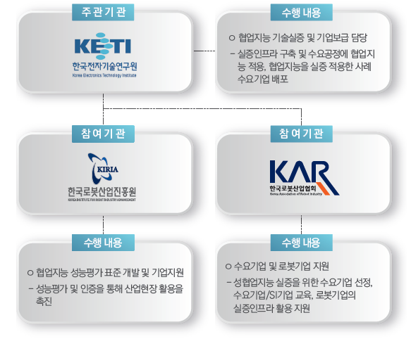

# 사업목표 및 추진체계

## 사업개요 및 목표
-  **(사업개요)** 협업지능 기술개발 및 보급을 위한 실증 인프라 구축 및 테스트베드 지원
-  **(사업목표)** 4대 공정 구축에 활용된 협업지능 운용기술의 고도화 및 보급을 통한 중소·중견 기업의
생산성 강화 지원
    - 4대공정 : 선반(Picking), 다축가공기(머신텐딩), 검사(형상), 셀간이동(시뮬레이션 )
-  **(사업기간)** 2020년 ~ 2024년

## 사업 추진체계

- [한국전자기술연구원](https://www.keti.re.kr)
- [한국로봇산업진흥원](https://www.kiria.org/)
- [한국로봇산업협회](http://www.korearobot.or.kr/)