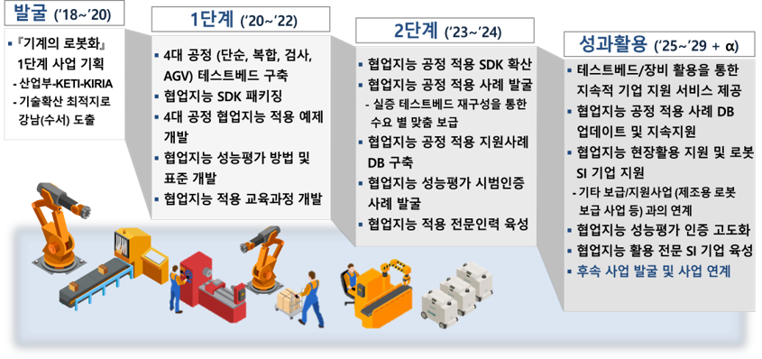

# 사업개요

## 사업개요 및 목표
- **(사업개요)** 협업지능 기술개발 및 보급을 위한 실증 인프라 구축 및 테스트베드 지원
- **(사업목표)** 4대 공정 구축에 활용된 협업지능 운용기술의 고도화 및 보급을 통한 중소·중견 기업의
생산성 강화 지원
    - 4대공정 : 선반(Picking), 다축가공기(머신텐딩), 검사(형상), 셀간이동(시뮬레이션 )
- **(사업기간)** 2020년 ~ 2024년

## 사업대상
- (로봇 공급기업) 로봇 제조기업, 로봇 SI기업
- (로봇 수요기업) 로봇 및 스마트공장 도입기업

## 사업범위
- 기계·로봇의 협업지능화를 위해 협업지능 모듈기반 실증 인프라 구축, 협업지능 운용기술 보급 및  산업별 상용화 지원 등 추진

<!--
아래 표 서식은 아래 웹페이지 참조
https://stackoverrun.com/ko/q/12782644
https://cofs.tistory.com/124
https://studyingych.tistory.com/6
-->
<table>
    <tbody>
        <tr>
            <td rowspan="2" align="center">실증 인프라 구축</td>
            <td align="center">개요</td>
            <td align="center">
                협업지능 응용 공정 발굴 및 실증을 위한 테스트베드 구축  
            </td>
        </tr>
        <tr>
            <td align="center">내용</td>
            <td>
                <ul type="dot">
                    <li>수요조사에 기반하여 협업지능 모듈 활용성이 높은 <b>제조공정 발굴</b>, 테스트베드 내 <b>모사 환경 구축 및 실증</b></li>
                    <li>다종의 센서/로봇/제조장비 기반의 테스트베드 내 <b>로봇 SI 실증</b> 및 협업지능 SDK <b>시범적용 환경 제공</b> </li>
                </ul>
            </td>
        </tr>
        <!---->
        <tr>
            <td rowspan="2" align="center">협업지능 기술지원</td>
            <td align="center">개요</td>
            <td align="center">
                수요 공정 별 협업지능 운용기술 (SDK 등) 개발/보급 및 상용화 지원
            </td>
        </tr>
        <tr>
            <td align="center">내용</td>
            <td>
                <ul type="dot">
                    <li>협업지능 운용기술 <b>수요기업 별 모듈화/고도화</b>를 통한 보급</li>
                    <li>협업지능 운용기술 <b>전문 SI 기업 육성</b>  (운용기술 교육, 수요기업 매칭)</li>
                    <li>기업 수요에 최적화된 <b>로봇 SI 전문기업 매칭 및 협업지능 모듈 보급</b>을 통한 산업현장 적용 지원</li>
                </ul>
            </td>
        </tr>
    </tbody>
</table>

## 사업로드맵
- 단계별 구축 테스트베드/장비 기반 협업지능 SDK 보급 및 지속 지원

