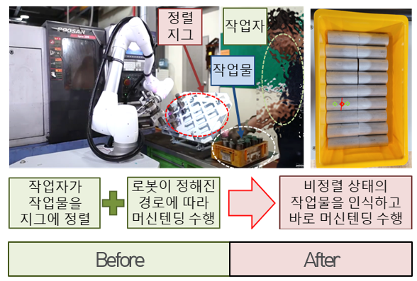

# 협업지능 SDK
- 단순가공(선반), 복합가공(MCT), 검사공정, 이송(셀 간이동) 등 주요 제조공정 내 요소공정의 협업지능 기반 자동화 지원 SDK 개발 및 보급 예정

# 개발예정 SDK

<!--
아래 표 서식은 아래 웹페이지 참조
https://stackoverrun.com/ko/q/12782644
https://cofs.tistory.com/124
-->
<table>
       <thead>
           <tr>
               <th>협업지능 기반 자동화 공정 예시</th>
           </tr>
       </thead>
       <tbody>
           <tr>
               <td>
                   <ul type="dot">
                      <li>비정렬 상태 ( 넘어진 것 포함 ) 작업물 인식 및 파지</li>
                   </ul>
                </td>
           </tr>
           <tr>
               <td>
                   <ul type="dot">
                      <li>사이즈가 소폭 변화한 작업물 파지점 인식 및 파지 (추가 교시 없이)</li>
                   </ul>
               </td>
           </tr>           
           <tr>
               <td>
                   <ul type="dot">
                      <li>작업물을 집어서 공작기계에 투입하는 경로 생성 (교시 최소화)</li>
                   </ul>
               </td>
           </tr>           
           <tr>
               <td>
                   <ul type="dot">
                      <li>비정렬 상태 작업물 파지계획 생성 및 작업대에 정렬/준비</li>
                   </ul>
               </td>
           </tr>           
           <tr>
               <td>
                   <ul type="dot">
                      <li>작업물 별 파지 계획 자동화 (내접 파지 / 외접 파지 / 2점 파지 / 3점 파지 / 파지 방향 등)</li>
                   </ul>
               </td>
           </tr>           
           <tr>
               <td>
                   <ul type="dot">
                      <li>머신 텐딩 중 작업물 조작을 통한 포즈 재정렬</li>
                   </ul>
               </td>
           </tr>           
           <tr>
               <td>
                   <ul type="dot">
                      <li>설계도/시방서를 인식하여 로봇이 수공구 등을 이용, 작업물의 기하 공차 검사</li>
                   </ul>
               </td>
           </tr>           
           <tr>
               <td>
                   <ul type="dot">
                      <li>모바일 로봇 등을 이용한 가공 스테이션 간 이송</li>
                   </ul>
               </td>
           </tr>           
           <tr>
               <td>
                   <ul type="dot">
                      <li>작업물 형상/표면 인식 기반 연마 및 표면처리 공정 (연삭, 블래스팅 등) 수행</li>
                   </ul>
               </td>
           </tr>
           <tr>
               <td>
                   <ul type="dot">
                      <li>작업 계획을 인식하여 작업물 간 조립성 검사 경로 생성 및 수행</li>
                   </ul>
               </td>
           </tr>
       </tbody>
</table>

