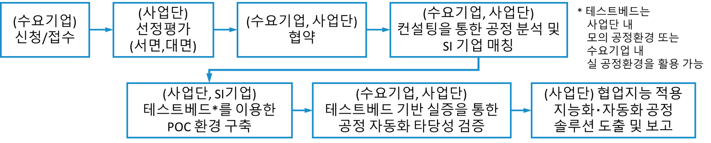

# 협업지능 도입 및 기업지원

## 로봇 도입 및 확산을 위한 기업 지원
- 협업지능 기술의 도입 컨설팅 및 상담 지원
- 수요기업 및 공급기업간 매칭 지원
- 협업지능 SI 전문기업의 육성ㆍ홍보 지원
- 대학, 전문연구소, 기업, 지원기관 등이 참여하는 다양한 협력 네트워크 운영

## 테스트베드 활용 로봇플러스 POC(Proof of Concept) 지원

### 지원개요
- 기업의 자동화 애로 공정 중 인공지능과 로봇 기술의 융합을 통해 해소 가능한 공정에 대해 협업지능 테스트베드를 활용하여 지능화‧자동화 솔루션을 도출하고 기업의 요구사항에 맞춘 타당성 검증을 지원

### 지원범위
- 자동화 애로 공정의 협업지능 기반 지능화‧자동화 컨셉 도출 지원
- 공정 지능화‧자동화 컨셉 검증/실증을 위한 POC환경 구축 (연간 최대 5개 기업 지원)
  * POC환경 구축을 위해 소요되는 로봇, 재료비 및 SI비용은 사업단에서 전액 부담 (기업 당 1억원 내외)하며, 구축된 시스템의 소유권은 사업단에 귀속
- 공정 자동화 SI 기업 매칭

### 지원절차

## 테스트 베드 구축
- 강남구 수서동 인근 예정